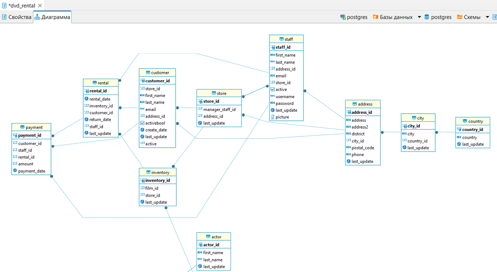
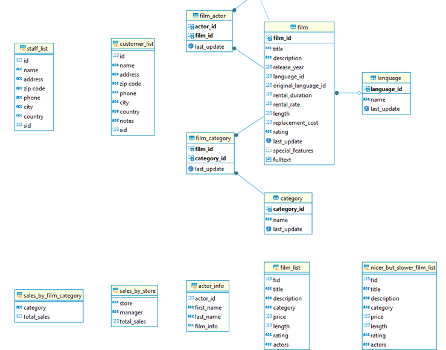
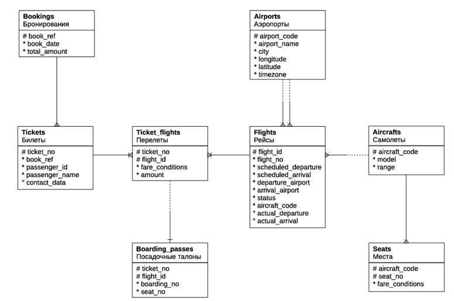

# **Демонстрационные базы данных**

## База данных: Пункт проката DVD-дисков

[Сайт для ознакомления и скачивания БД](https://www.postgresqltutorial.com/postgresql-getting-started/postgresql-sample-database/)

Данная база данных использовалась для написания запросов по текущим заданиям в ходе обучения.

#### *Диаграмма*
 
#### *Диаграмма (продолжение)*
 

## База данных: Авиаперевозки по России

[Сайт для ознакомления и скачивания БД](https://postgrespro.ru/education/demodb)

Данная база данных использовалась для написания запросов при выполнении итогового проекта.

#### *Диаграмма*

 

[Скачать](https://drive.google.com/file/d/1oD0C3zaAY2OJeGboCQoRmK5RziDjR-4J/view?usp=sharing) описание вышеуказанной демонстрационной БД.

### Используемая СУБД:

### Програмное обеспечение:
